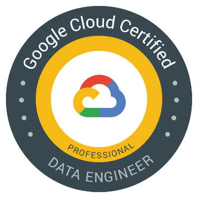

# Hi there 👋

## 💡 What I’m Working On
⚙️ Building robust back-end systems with Go
🔭 Developing innovative mobile apps using Flutter  
💻 Exploring AI and its applications in everyday tools  

---

## 🌟 **My Apps**
### iOS Apps

Discover my iOS apps on the App Store! 🎨✨  
🔗 [View Apps](https://apps.apple.com/jp/developer/kotaro-yamazaki/id1701632846)

### Android Apps

Explore my Android apps on Google Play! 🎮🎉  
🔗 [View Apps](https://play.google.com/store/developer?id=torako)

---

## 🏅 **Certifications**

📜 Google Cloud Professional Data Engineer  
Earned through mastering data solutions and cloud architecture.

---

## 📫 **Connect with Me**
Feel free to reach out or connect with me through:  
- LinkedIn: [[Kotaro Yamazaki]](https://www.linkedin.com/in/kotaro-yamazaki-60a491169/)  
- X(Twitter): [@kotapjp](https://x.com/kotapJP)
